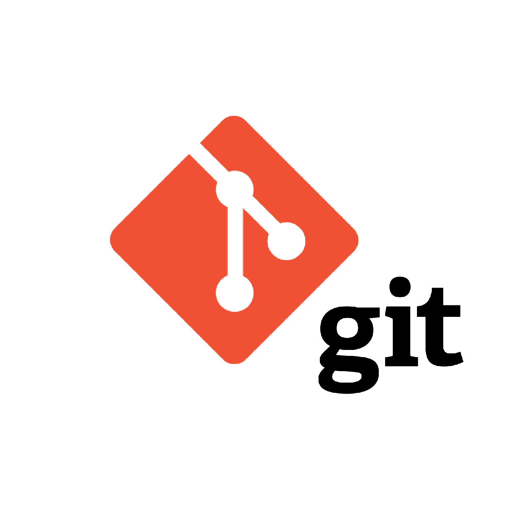

# Инструкция по работе с Git
## Что такое Git?
Git - это консольная утилита, для отслеживания и ведения истории изменения файлов, в вашем проекте. Чаще всего его используют для кода, но можно и для других файлов.

## Настройка

Вы установили себе Git и можете им пользоваться. Давайте теперь его настроим, чтобы когда вы создавали commit, указывался автор, кто его создал.

Открываем терминал (Linux и MacOS) или консоль (Windows) и вводим следующие команды.


Установим имя для вашего пользователя. Вместо <ваше_имя> можно ввести, например, Kirill_Lepetukha, кавычки оставляем.
```
git config --global user.name "<ваше_имя>"
```
Теперь установим email. Принцип тот же.

```
git config --global user.email "<адрес_почты@email.com>"
```
## Создание репозитория

Теперь вы готовы к работе с Git локально на компьютере.

Создадим наш первый репозиторий. Для этого пройдите в папку вашего проекта.

### Git init
Для инициализация/создание репозитория необходимо выполниить команду `git init` в папке с репозиторием.
### Git add
Для добавления изменений в коммит используется команда `git add`. Чтобы использовать комманду напишите `git add <имя_файла>`

### Git status
Для того чтобы посмотреть состояние репозитория используется команда `git status`.

### Git commit
Для того чтобы создать коммит нужно выполнить команду `git commit`, для этого в терминале нужно написать  `git commit -m "<комментарий>" `

## Процесс работы с Git

Не стоит после каждого изменения файла делать commit. Чаще всего их создают, когда:

* Создан новый функционал

* Добавлен новый блок на верстке

* Исправлены ошибки по коду

* Вы завершили рабочий день и хотите сохранить код

Это поможет держать вашу ветки в чистоте и порядке. Тем самым, вы будете видеть историю изменений по каждому нововведению в вашем проекте, а не по каждому файлу.

## Ветка

Ветка - это набор *commit* (кружок), которые идут друг за другом. У ветки есть название, основную ветку чаще всего называют *master* (на картинках будет называться main) . Если говорить простыми словами, то ветка *master* - это наш проект.

Другие ветки - это отдельное место для реализации нового функционала или исправление багов (ошибок) нашего проекта. То есть, с отдельной веткой вы делаете что угодно, а затем сливаете эти изменения в основную ветку master.

### Создание ветки
Для того, чтобы создать новую ветку вводим:

`git branch <название_ветки>`

При создании новой ветки, старайтесь называть ее кратким и ёмким именем. Чтобы сразу было понятно, что именно изменялось по проекту. Если вы используете, какую-нибудь систему для ведения задач, то можете в начале названия ветки указывать ID задачи, чтобы можно было легко найти, на основе какой задачи была создана ветка. Например вот так:

`3424_fix_catalog_ajax`

### Переключение между ветками
В каждом новом commit следует оставлять коммент и в нем описывать суть изменений.
Переключаться между ветками можно такой командой:

`git checkout <название_ветки>`

### Добавление изменеий в ветку master

После того, как вы завершили работу над своей задачей, ветку можно слить в master . Для этого нужно переключиться в ветку master и выполнить следующую команду:
```
# Переключаемся в master
git checkout master
# Обновляем локальную ветку с сервера
git pull origin master

# Делаем merge вашей ветки, в ветку в которой вы находитесь
# В данном примере это master
git merge <название_ветки>
```

## Конфликт
 Иногда один и тот же контент могут редактировать сразу несколько разработчиков. Если разработчик A попытается изменить код, который редактирует разработчик B, может произойти конфликт. 
## Раздел для конфликта

Данный раздел предназначен для совершения конфликта.


## Удаленный репозиторий

### Git clone

Эта команда позволяет склонировать внешний репозиторий на наш ПК

### Git pull
Эта команда позволяет скачать все из текущего репозитория и автоматически
сделать merge с нашей версией 

### Git push

эта команда позволяет отправить нашу версию репозитория на внешний
репозиторий. ТРЕБУЕТ АВТОРИЗАЦИИ на внешнем репозитории 

### Как сделать pull request

Делаем fork репозитория
* Делаем clone СВОЕЙ версии репозитория
* Создаем новую ветку и в НЕЕ вносим свои изменения
* Фиксируем изменения (делаем коммиты)
* Отправляем свою версию в свой GitHub
* На сайте GitHub нажимаем кнопку pull request 

